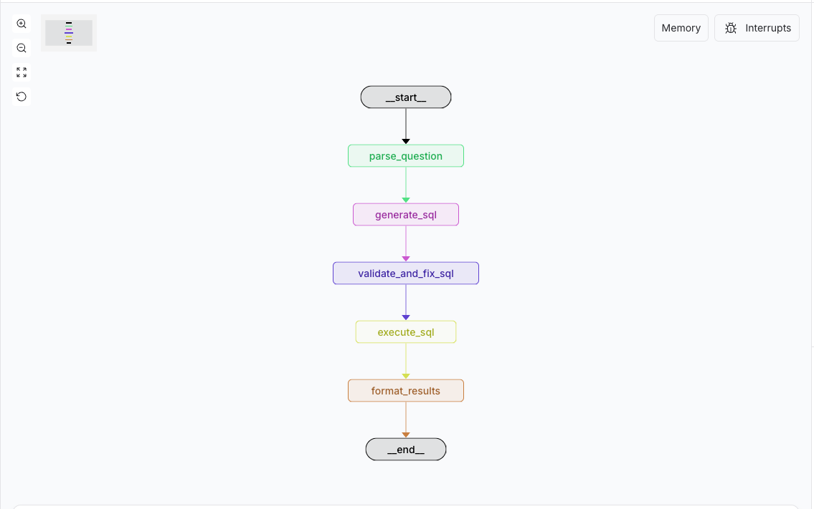
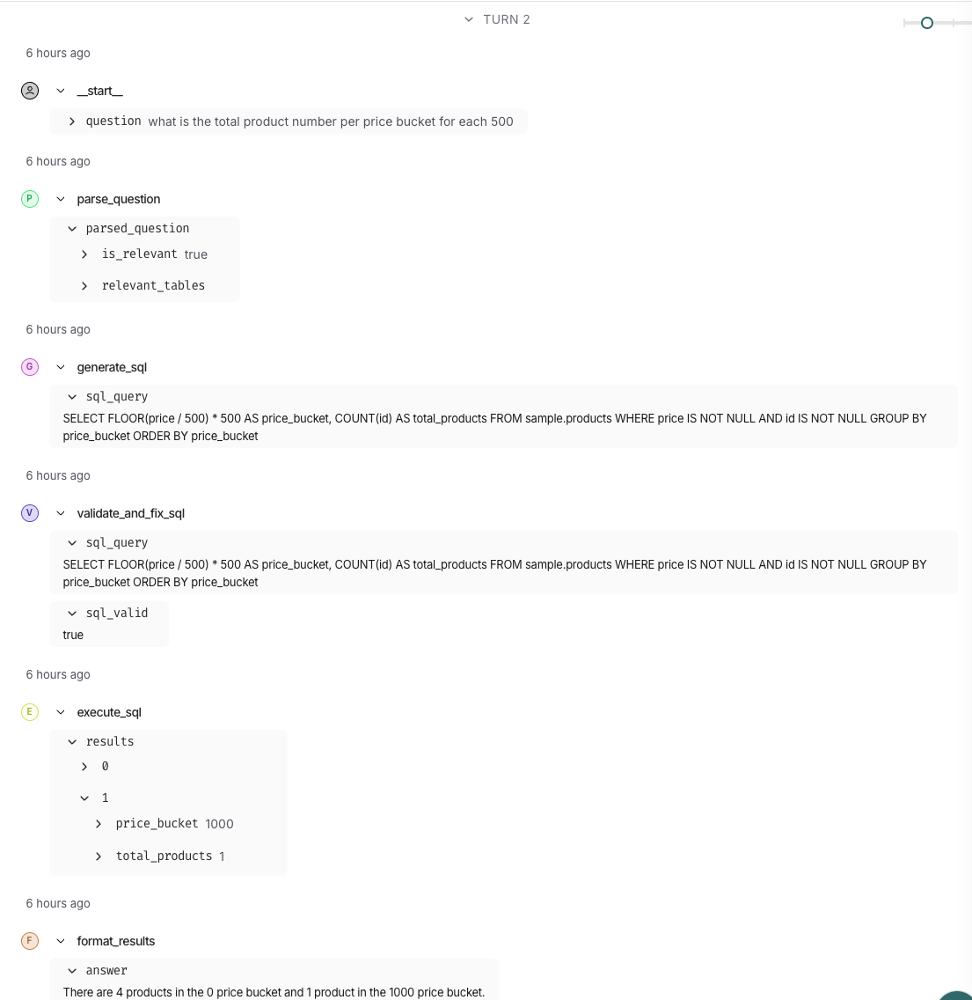
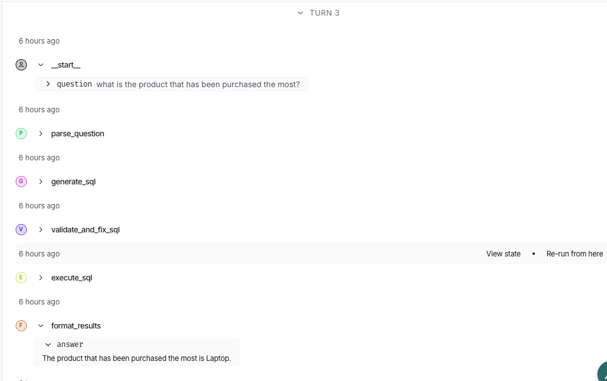

# TEXT TO SQL Project
This project is for demo of using LLM to create the agent application. The purpose of this agent is to translate the natural language to query the database via SQL

## Overview of the Agent



Here is the steps for SQL agent execution:

1. **`Parse Question`**: Regarding to the input question, ask the LLM the question is relevant to the database or not?
2. **`Generate SQL`**: If the question is relevant to the database, generate the SQL query for preparing using LLM within the schema getting from the database itself
3. **`Validate and fix SQL`**: The SQL returned might be incorrect to run, using LLM to validate it and fix if found the error
4. **`Execute SQL`**: Using the fixed SQL was returned from the LLM, run the SQL to get the data from the local database
5. **`Format the result`**: Instead of only sending the data which is returned from the database, format the result in human-readable format

## Setup

To run locally, you need:
1. [git](https://git-scm.com/book/en/v2/Getting-Started-Installing-Git)
2. [Github account](https://github.com/)
3. [Docker](https://docs.docker.com/engine/install/) with at least 6GB of RAM and [Docker Compose](https://docs.docker.com/compose/install/) v1.27.0 or later
4. [Langsmith account](https://smith.langchain.com/)
5. [AI Google Studio account](https://aistudio.google.com/)

Prerequisites
- AI Google Studio API key
- Change the .env.sample to .env
- Put the API key was created above into the .env file

Clone the repo and run the following commands to start setting up the enviroment:

```bash
git clone https://github.com/truongbk24/text-2-sql/
cd text-2-sql/
docker compose up -d
langgraph dev # to run the langsmit studio
```

## Example
Question 1: what is the total product number per price bucket for each 500?


Question 2: what is the product that has been purchased the most?



Tear down
```bash
docker compose down -v
```